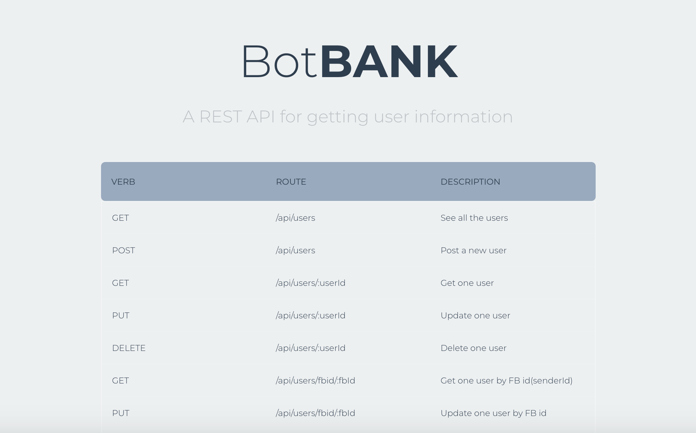
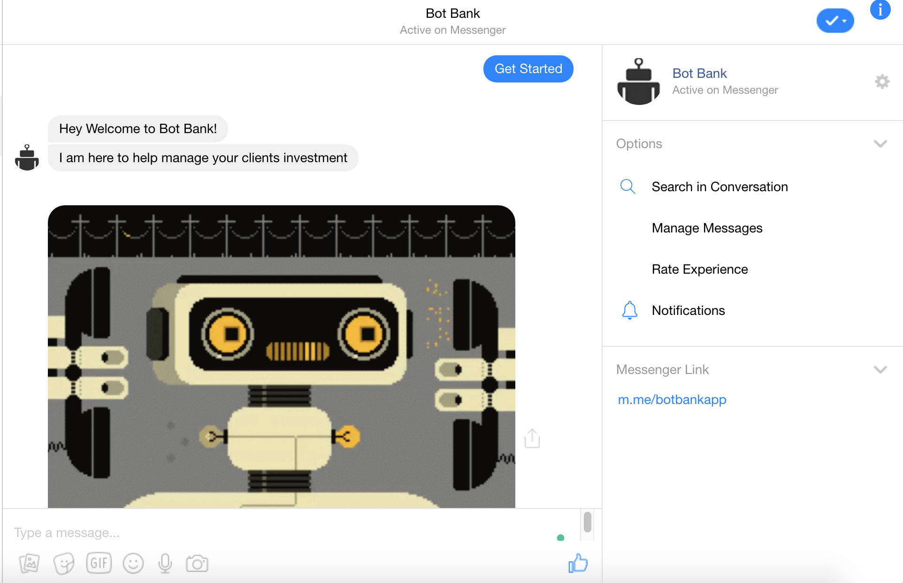

# Bot-Bank-API

An API to get clients real-time investment information. Bank advisors can interact with the bot to find trends in the clients investments and help with better portfolio management

Link: https://bot-bank-api.herokuapp.com/api

## Chatbot Interaction

The chatbot is powered by Google Dialogflow which handles the query and helps the banker get real-time client information

  
Make a New User: https://bot-bank-api.herokuapp.com/add?senderId=567

Add Clients and See the Portfolio Value: https://bot-bank-api.herokuapp.com/add?senderId=567
